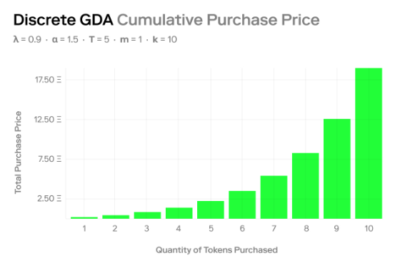

# Jackpot: A Modern Lottery Structure

> All code in this repository is unaudited. Use at your own at risk.

In todays ecosystem, the idea of a lottery, raffle, and generalize gambling mechanism operates on the base of a non-fungible thought model. Jackpot aims to redefine that through a manner of pool positions that enable multi-token collateral.

On top of that, Jackpot introduces the support of dynamic qualifiers that allow a Jackpot seeder to define the requirements of entry ranging from entirely on-chain to almost entirely off-chain.

There is no reason for multiple raffle/lottery mechanisms to exist. Instead, Jackpot is a public good that is permissionless and trustless from day one. No need to build trust because there is no way to break it.


### Key Model Notes

#### Constants

```solidity
/// @dev Prevent the same token from being used in quick succession.
int256 fingerprintDecayConstant;
/// @dev GDA implementation for seeder controlled entry pricing.
int256 priceInitial;
int256 priceScaleConstant;
int256 priceDecayConstant;
int256 startTime;
/// @dev Enabling permisionsless and non-oracle running jackpot distribution.
int256 endTime;
```
#### Token Qualifier

A qualifier is a single object instance that defines a single-layer rule of access. This means, that a Jackpost seeder maintains the ability to define a list of tokens that can lead to opening the gate.

```solidity
address token;
uint256 quantity;
uint256 max;
bool required;
```

- No tokens could be required.
- A single token in a list of tokens could be required.
- A full bundle of tokens could be required.
- Different types of tokens could be required. (ERC20, ERC1155, and ERC721)

The posibilities are endless.

#### Signature Qualifier

As actions become more complex it can become difficult to offer multi-level access while attempting to do everything on-chain. Instead, one can simply connect to the API and use that as the source of verification of truth of a **signature based qualifier**.

```solidity
address signer;
```

#### Prize Pools

A standard risk of anything built on-chain is that surface area in doom scenarios can lead to max contagion. To limit this, Prize Pools are independent clone contracts that are completely separate from the rest of the moving pieces.

With this, the ability to strip back association-level data exists which enables *Vault Positioning* for all Prize Pools. This additionally means, that given the desire, Prize Pools could be reused once their previous Jackpot concludes and has been emptied.

#### Jackpot Expirations

A common risk with running a lottery or raffle is the downside loss of the asset being delivered. Instead, Jackpot is built on the idea that just as their are 'ticket-buyer' qualifiers, there are also 'drawing' qualifiers.

With this, at the time of creating the raffle the creator sets the draw date, but at the same time sets metric qualifiers that must be met in order for the "drawing" to become active. If the reverse qualifiers are not met, the Jackpot is cancelled and all funds are made available to claim by all those that entered the now cancelled Jackpot.

#### GDA Entry Pricing

In an on-chain lottery there exists the longtail MEV opportunity to bot-jam a raffle seconds before the winner is drawn up to the point of =EV. While gambling, numbers do not lie and this is one of the benefit packed downsides of using provable randomness and immutable raffles.

To avoid this, Jackpot is built on top of [GDA pricing](https://www.paradigm.xyz/2022/04/gda) which allows the seeder of a Jackpot to control the pricing curve of their entries. With this, this enables the ability for someone to average-down their entry price given future circumstances.



Instead of flat-rate entry prices, they are fluid to the state of raffle.

#### Entry Fingerprints

The majority of on-chain lottery systems are absurdly exploitable through the use of multiple wallets. For example, [MetaWin](https://metawin.com/) who launched with one of the worst Lottery contracts I have seen to date, resolves entries down to the address.

Meaning, if a raffle uses a token as a qualifier, then all that needs to be done is moving that token to a new address and now a new entry can be earned -- importantly, while following all technical rules that exist. MetaWin is just a very bad product.

Fixing this though, brings a large suit of benefits one may not expect:

1. The usage of tokens are fingerprinted based on the prize pool, the token contract and the token id.

This means that not only can users not re-enter using the same token an infinite amount of times. But, that we can add a fingerprintDecayConstant to control *when* that token could be re-used.

Completely solving the issue of reuse by properly using the benefits of non-fungible positions.

Then, if someone has entered using a token for a qualifier, even if it is sold on the secondary market, the new buyer can enter the raffle once the tokens fingerprint decay has reached zero again.

#### Permissionless Distribution

Again, MetaWin has shown us what not to do here but only allowing the kickstart of a draw to be triggered by the team. Built on the public statement of "We want to build trust" and they are doing everything in their power to do the opposite.

Instead, Jackpot offers permisionless trigger events. As pool participants are inherently incentivized to kick off the draw, I expect this to handle itself. However, because it is open permission that means that technically anyone can trigger the event and that a DAO could run a keeper to handle this automatically.

### Author Notes

Some of the code is super broken right now. This repository started as an exploration into different access models that quickly ballooned into this larger idea. Please do not take any of this code as a professional opinion of mine or something that I would endorse. Instead, this repository should serve as a public good / thought for what a better future looks like when we don't have idiots leading the charge with contracts like MetaWin.

If you have any ideas, submit a PR. No promises I implement it, but whoever makes a genuine lottery system will see millions in action because random distribution is not so simple as *just gambling*.

## Running The Project

Try running some of the following tasks:

```shell
npx hardhat help
npx hardhat test
GAS_REPORT=true npx hardhat test
npx hardhat node
npx hardhat run scripts/deploy.js
```
